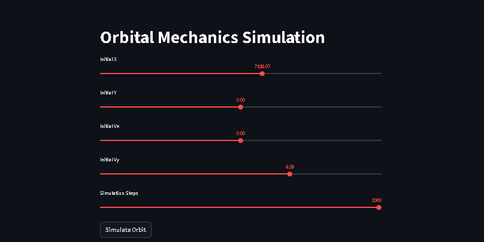
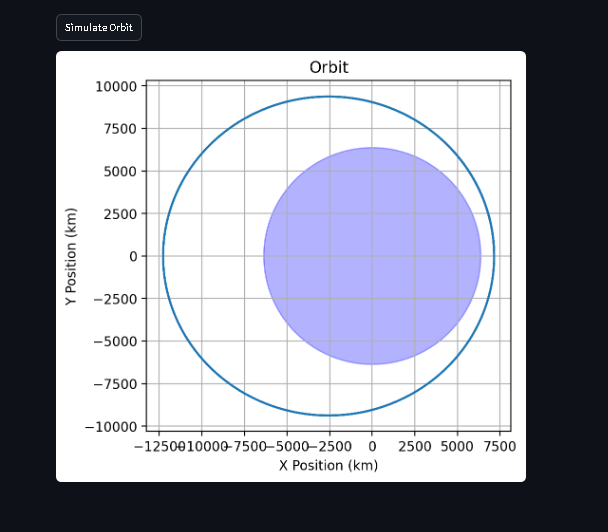

# Orbital Mechanics Simulation System

## Description
This project implements a physics-based orbital simulation using numerical integration.  
It models two-body orbital motion and exposes the simulation through a FastAPI backend with an interactive Streamlit UI.  
The backend is containerized with Docker for reproducible deployment.

---

## Features
- Two-body orbital simulation using Newtonian gravity  
- RK4 numerical integration  
- Interactive UI (Streamlit)  
- REST API (FastAPI)  
- Dockerized backend  

---

## Tech Stack
- Python  
- NumPy  
- FastAPI  
- Streamlit  
- Matplotlib  
- Docker  

---

## Demo

### UI View


### Orbit Output


---

## Run Locally

### 1. Create and activate virtual environment
```bash
python -m venv venv
venv\Scripts\activate
```

### 2. Start backend (API)
```bash
cd api
pip install -r requirements.txt
python -m uvicorn main:app --reload
```

### 3. Start frontend (Streamlit)
```bash
venv\Scripts\activate
cd app
pip install -r requirements.txt
python -m streamlit run app.py
```

---

## Run with Docker (Backend)
```bash
cd api
docker build -t orbital-api .
docker run -p 8000:8000 orbital-api
```

Then open:
http://localhost:8000/docs

---

## API Endpoint

POST /simulate

```json
{
  "x": 7000,
  "y": 0,
  "vx": 0,
  "vy": 7.5,
  "steps": 1000
}
```

Returns arrays of x and y positions representing the orbital trajectory.

---

## How It Works
- State = [x, y, vx, vy]  
- Gravity determines acceleration  
- Numerical integration predicts the position of the system forward in time  
- Output is trajectory over time  

---

## Notes
This project demonstrates how mathematical models of physical systems can be transformed into deployable, interactive applications. It combines numerical methods, backend engineering, and user interface design into a cohesive simulation system.
